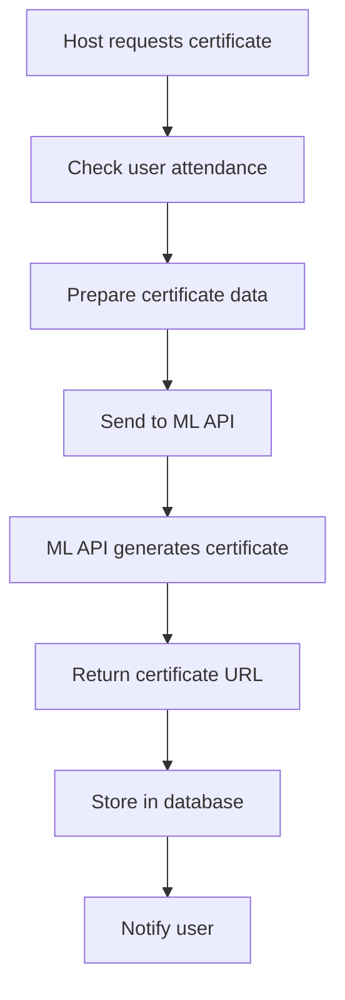
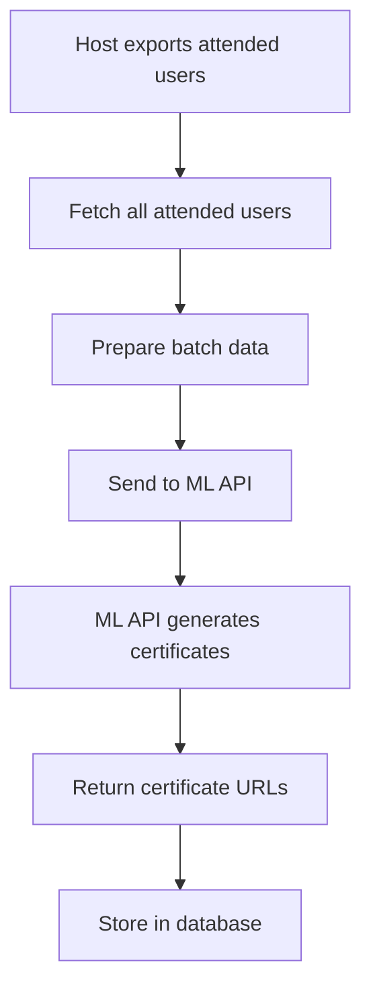

# ML Certificate Integration Guide

## Overview

This document provides comprehensive information for the ML team about the certificate generation system integration in CampVerse. The backend is designed to send data to your ML API for certificate generation and handle the responses.

---

## 🔗 API Integration Points

### **1. Certificate Generation API**

**Endpoint**: `POST /api/certificates/generate`

**Purpose**: Generate a certificate for a user who attended an event

**Data Sent to ML API**:
```json
{
  "userName": "John Doe",
  "userEmail": "john.doe@college.edu",
  "eventTitle": "Tech Hackathon 2024",
  "eventDescription": "A 24-hour coding challenge...",
  "eventDate": "2024-01-15T10:00:00.000Z",
  "eventLocation": "Online",
  "organizerName": "Tech Club",
  "institutionName": "Central University",
  "certificateType": "participant",
  "userSkills": ["JavaScript", "React", "Node.js"],
  "eventTags": ["hackathon", "coding", "innovation"],
  "attendanceDate": "2024-01-15T14:30:00.000Z",
  "qrCode": "data:image/png;base64,iVBORw0KGgoAAAANSUhEUgAA...",
  "eventDuration": 86400000,
  "userInterests": ["web development", "AI"],
  "eventType": "hackathon",
  "isPaid": false,
  "price": 0
}
```

**Expected ML API Response**:
```json
{
  "success": true,
  "requestId": "cert_12345_67890_1705312800000",
  "certificateURL": "https://storage.example.com/certificates/cert_12345_67890.pdf",
  "generationStatus": "generated"
}
```

---

### **2. Export Attended Users API**

**Endpoint**: `GET /api/certificates/export-attended/{eventId}`

**Purpose**: Export all attended users for batch certificate generation

**Data Sent to ML API**:
```json
{
  "eventId": "507f1f77bcf86cd799439011",
  "eventTitle": "Tech Hackathon 2024",
  "eventDescription": "A 24-hour coding challenge...",
  "eventDate": "2024-01-15T10:00:00.000Z",
  "eventLocation": "Online",
  "organizerName": "Tech Club",
  "totalAttended": 25,
  "attendedUsers": [
    {
      "userId": "507f1f77bcf86cd799439012",
      "userName": "John Doe",
      "userEmail": "john.doe@college.edu",
      "userSkills": ["JavaScript", "React"],
      "userInterests": ["web development"],
      "attendanceDate": "2024-01-15T14:30:00.000Z",
      "certificateType": "participant"
    },
    {
      "userId": "507f1f77bcf86cd799439013",
      "userName": "Jane Smith",
      "userEmail": "jane.smith@college.edu",
      "userSkills": ["Python", "Machine Learning"],
      "userInterests": ["AI", "data science"],
      "attendanceDate": "2024-01-15T15:00:00.000Z",
      "certificateType": "participant"
    }
  ]
}
```

---

## 🛠️ ML API Requirements

### **Required Endpoints**

Your ML API should provide the following endpoints:

#### **1. Single Certificate Generation**
```
POST /generate-certificate
```

**Request Body**: Certificate data (as shown above)
**Response**: Certificate URL and status

#### **2. Batch Certificate Generation (Optional)**
```
POST /generate-certificates-batch
```

**Request Body**: Array of certificate data
**Response**: Array of certificate URLs and statuses

---

### **Expected Response Format**

```json
{
  "success": true,
  "requestId": "unique_request_id",
  "certificateURL": "https://storage.example.com/certificates/cert_12345.pdf",
  "generationStatus": "generated",
  "metadata": {
    "generatedAt": "2024-01-15T16:00:00.000Z",
    "template": "hackathon_participant",
    "version": "1.0"
  }
}
```

### **Error Response Format**

```json
{
  "success": false,
  "error": "Template not found",
  "errorCode": "TEMPLATE_ERROR",
  "requestId": "unique_request_id"
}
```

---

## 🔧 Configuration

### **Environment Variables**

The backend expects these environment variables for ML API integration:

```bash
# ML Certificate API Configuration
ML_CERTIFICATE_API_URL=https://your-ml-api-domain.com
ML_API_KEY=your_api_key_here
```

### **API Configuration**

```javascript
const ML_API_CONFIG = {
  baseURL: process.env.ML_CERTIFICATE_API_URL,
  timeout: 30000, // 30 seconds
  headers: {
    'Content-Type': 'application/json',
    'Authorization': `Bearer ${process.env.ML_API_KEY}`
  }
};
```

---

## 📊 Certificate Types

The system supports these certificate types:

| Type | Description | Use Case |
|------|-------------|----------|
| `participant` | Event participation | Default for attendees |
| `winner` | Event winner | For competition winners |
| `organizer` | Event organizer | For event hosts |
| `co-organizer` | Co-organizer | For co-hosts |

---

## 🔍 Certificate Verification

### **QR Code System**

Each certificate includes a QR code for verification:

```javascript
// QR Code Data Structure
{
  certificateId: "cert_12345_67890_1705312800000",
  userId: "507f1f77bcf86cd799439012",
  eventId: "507f1f77bcf86cd799439011",
  issuedAt: "2024-01-15T16:00:00.000Z"
}
```

### **Verification Endpoint**

```
POST /api/certificates/verify
```

**Request**: QR code data
**Response**: Certificate validity and details

---

## 📈 Certificate Statistics

### **User Certificate Stats**

```
GET /api/certificates/stats
```

**Response**:
```json
{
  "totalCertificates": 15,
  "generatedCertificates": 12,
  "pendingCertificates": 3,
  "stats": [
    { "_id": "generated", "count": 12 },
    { "_id": "pending", "count": 2 },
    { "_id": "failed", "count": 1 }
  ]
}
```

---

## 🔄 Retry Mechanism

### **Failed Certificate Retry**

```
POST /api/certificates/{certificateId}/retry
```

**Purpose**: Retry failed certificate generation
**Use Case**: Network issues, ML API downtime, template errors

---

## 📋 Data Flow

### **1. Certificate Generation Flow**



### **2. Batch Export Flow**



---

## 🎯 Integration Checklist

### **For ML Team**

- [ ] **Deploy ML API** with certificate generation endpoints
- [ ] **Provide API URL** and authentication key
- [ ] **Test certificate generation** with sample data
- [ ] **Implement error handling** for various scenarios
- [ ] **Set up certificate storage** (cloud storage recommended)
- [ ] **Create certificate templates** for different event types
- [ ] **Test QR code generation** and verification
- [ ] **Implement batch processing** for multiple certificates

### **For Backend Team**

- [x] **Certificate model** with ML API integration
- [x] **Certificate controller** with all endpoints
- [x] **Certificate routes** with Swagger documentation
- [x] **QR code generation** and verification
- [x] **Error handling** and retry mechanism
- [x] **Environment configuration** for ML API
- [x] **Testing endpoints** for certificate generation

---

## 🧪 Testing

### **Test Data**

Use these test scenarios:

1. **Single Certificate Generation**
   - Valid user and event
   - User attended the event
   - ML API responds successfully

2. **Batch Certificate Generation**
   - Multiple attended users
   - Different certificate types
   - ML API batch processing

3. **Error Scenarios**
   - ML API unavailable
   - Invalid certificate data
   - Template not found
   - Network timeout

### **Test Endpoints**

```bash
# Test certificate generation
curl -X POST http://localhost:5001/api/certificates/generate \
  -H "Authorization: Bearer YOUR_JWT_TOKEN" \
  -H "Content-Type: application/json" \
  -d '{
    "userId": "USER_ID",
    "eventId": "EVENT_ID",
    "certificateType": "participant"
  }'

# Test export attended users
curl -X GET http://localhost:5001/api/certificates/export-attended/EVENT_ID \
  -H "Authorization: Bearer YOUR_JWT_TOKEN"

# Test certificate verification
curl -X POST http://localhost:5001/api/certificates/verify \
  -H "Content-Type: application/json" \
  -d '{
    "qrCode": "QR_CODE_DATA"
  }'
```

---

## 📞 Support

### **Contact Information**

- **Backend Team**: For API integration issues
- **ML Team**: For certificate generation issues
- **DevOps**: For deployment and infrastructure

### **Documentation**

- **API Docs**: http://localhost:5001/api-docs
- **Swagger UI**: Interactive API testing
- **GitHub**: Repository with latest code

---

## 🚀 Next Steps

1. **ML Team**: Deploy certificate generation API
2. **Backend Team**: Update ML API URL and key
3. **Testing**: Test certificate generation flow
4. **Production**: Deploy to production environment
5. **Monitoring**: Set up monitoring and alerts

---

**CampVerse Certificate System is ready for ML integration! 🎉** 