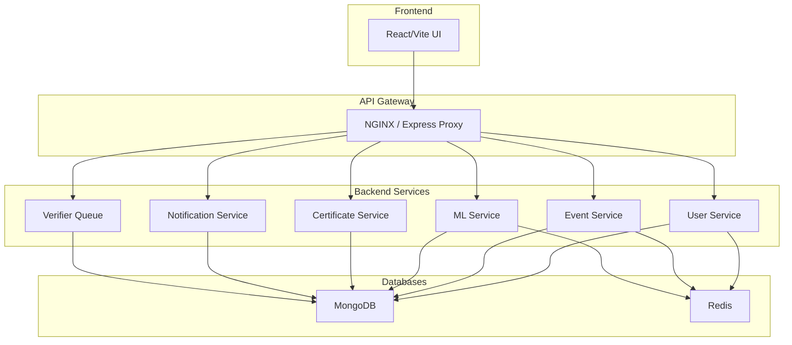

# Backend - CAMPVERSE

Welcome to the **backend** of **CAMPVERSE** — a modular, service-oriented event personalization platform. This backend exposes RESTful APIs for user management, event handling, authentication, verification, and more.

---

## ✨ System Overview
- **Microservice-inspired:** Each module (User, Event, ML, etc.) is logically separated for scalability and clarity.
- **API Gateway:** All requests flow through a gateway (NGINX/Express proxy) to backend services.
- **Database:** MongoDB for persistent data, Redis for caching, sessions, OTP, and password reset tokens.
- **CI/CD:** Automated with GitHub Actions, Docker, and ready for K8s/ECS deployment.

### **Service Architecture**


---

## 🚀 User Module: API Endpoints & Flows

### **Authentication & Registration**
| Endpoint            | Method | Request Body / Params                                                                 | Success Response Example                                                                 | Error Response Example                  |
|---------------------|--------|-------------------------------------------------------------------------------------|------------------------------------------------------------------------------------------|-----------------------------------------|
| `/register`         | POST   | `{ name, email, phone, password }`                                                   | `{ message: 'OTP sent to email.' }`                                                      | `{ error: 'All fields ... required.' }` |
| `/verify`           | POST   | `{ email, otp }`                                                                     | `{ message: 'Registration successful, logged in.', token, user }`                        | `{ error: 'Invalid OTP.' }`             |
| `/login`            | POST   | `{ email, password }`                                                                | `{ token, user }`                                                                        | `{ error: 'Incorrect password.' }`      |
| `/google-signin`    | POST   | `{ token }` (Google ID token)                                                        | `{ message: 'Google login successful', token, user }`                                    | `{ error: 'Google login failed.' }`     |

### **Profile & Preferences**
| Endpoint            | Method | Request Body / Params                                                                 | Success Response Example                                                                 | Error Response Example                  |
|---------------------|--------|-------------------------------------------------------------------------------------|------------------------------------------------------------------------------------------|-----------------------------------------|
| `/me`               | GET    | JWT in Authorization header                                                          | `user` object                                                                            | `{ error: 'User not found.' }`          |
| `/me`               | PATCH  | Any of: `{ name, phone, Gender, DOB, profilePhoto, collegeIdNumber, interests, ...}` | `{ message: 'Profile updated.', user }`                                                  | `{ error: 'No valid fields to update.' }`|
| `/updatePreferences`| POST   | `{ collegeIdNumber, interests, skills, learningGoals, badges, location }`            | `{ message: 'Preferences updated.', user }`                                              | `{ error: 'Server error ...' }`         |

### **User Dashboard & Statistics**
| Endpoint            | Method | Request Body / Params | Success Response Example | Error Response Example |
|---------------------|--------|----------------------|-------------------------|-----------------------|
| `/`                 | GET    | JWT in Authorization | `{ user, stats }`       | `{ error: ... }`      |

### **User Management & Roles**
| Endpoint                | Method | Request Body / Params | Success Response Example | Error Response Example |
|-------------------------|--------|----------------------|-------------------------|-----------------------|
| `/:id`                  | GET    | JWT, userId param    | `user` object           | `{ error: ... }`      |
| `/:id`                  | PATCH  | JWT, userId param, fields to update | `{ message: 'User updated.', user }` | `{ error: ... }` |
| `/:id`                  | DELETE | JWT, userId param    | `{ message: 'User deleted.' }` (admin) or `{ message: 'Account deletion requested. Your profile will be deleted in 30 days.' }` (self) | `{ error: ... }` |
| `/:id/grant-host`       | POST   | JWT, userId param, `{ remarks? }`   | `{ message: 'Host access granted.', user }` | `{ error: ... }` |
| `/:id/grant-verifier`   | POST   | JWT, userId param, `{ remarks? }`   | `{ message: 'Verifier access granted.', user }` | `{ error: ... }` |

### **Certificates, Achievements, Events**
| Endpoint                | Method | Request Body / Params | Success Response Example | Error Response Example |
|-------------------------|--------|----------------------|-------------------------|-----------------------|
| `/:id/certificates`     | GET    | JWT, userId param    | `[ ...certificates ]`   | `{ error: ... }`      |
| `/:id/achievements`     | GET    | JWT, userId param    | `[ ...achievements ]`   | `{ error: ... }`      |
| `/:id/events`           | GET    | JWT, userId param    | `{ hosted, attended, saved, waitlisted }` | `{ error: ... }` |

### **Password Reset**
| Endpoint            | Method | Request Body / Params | Success Response Example | Error Response Example |
|---------------------|--------|----------------------|-------------------------|-----------------------|
| `/forgot-password`  | POST   | `{ email }`          | `{ message: 'If the email exists, a reset link has been sent.' }` | `{ error: ... }` |
| `/reset-password`   | POST   | `{ token, password }`| `{ message: 'Password reset successful.' }` | `{ error: ... }` |

---

## 🛡️ Security & Access Control
- **JWT Authentication:** All protected endpoints require a valid JWT in the `Authorization` header.
- **Role-Based Access:**
  - Only `platformAdmin` can assign `host` or `verifier` roles.
  - `requireRole` and `requireSelfOrRole` middleware enforce access.
- **Account Deletion:**
  - Users can request deletion of their own profile; account is scheduled for deletion in 30 days (`deletionRequestedAt`, `deletionScheduledFor` tracked).
  - Admins can delete any user immediately.
- **Sensitive Data:** Passwords are hashed, sensitive fields never returned.
- **Rate Limiting:** Sensitive endpoints are protected from abuse.
- **Logging:** All errors and important actions are logged (Winston).
- **API Docs:** Swagger UI available at `/api-docs`.

---

## 📚 API Documentation (Swagger UI)

### **Interactive API Docs for CampVerse Backend**

All backend API endpoints are documented and testable via an interactive Swagger UI.

### **How to Access**
- Open your browser and go to:  
  **[http://localhost:5001/api-docs/](http://localhost:5001/api-docs/)**

### **Features & Benefits**
- **Interactive:** Try out any API endpoint directly from the browser.
- **Visual:** Endpoints are grouped by module (User, Host, etc.) for easy navigation.
- **Self-updating:** Docs update automatically as new endpoints and comments are added.
- **Frontend-friendly:** See exactly what data to send and what to expect in responses.
- **Authentication:** Add your JWT token in the UI to test protected routes.

### **Tips for Use**
- Use the "Try it out" button to send real requests and see live responses.
- All required fields, request/response formats, and error codes are shown for each endpoint.
- If you add new routes or update Swagger comments, **restart the backend server** (or Docker containers) to refresh the docs.
- The docs are helpful for both backend and frontend teams to ensure smooth integration.

---

## 🏫 Institution Module API

### **Available Endpoints**

| Method | Endpoint                                      | Description                                 | Role Required         |
|--------|-----------------------------------------------|---------------------------------------------|----------------------|
| POST   | /api/institutions                             | Create a new institution                    | platformAdmin        |
| GET    | /api/institutions                             | Get all institutions                        | platformAdmin        |
| GET    | /api/institutions/:id                         | Get institution by ID                       | platformAdmin/self   |
| PATCH  | /api/institutions/:id                         | Update institution                          | platformAdmin        |
| DELETE | /api/institutions/:id                         | Delete institution                          | platformAdmin        |
| POST   | /api/institutions/:id/request-verification    | Request institution verification            | student              |
| POST   | /api/institutions/:id/approve-verification    | Approve institution verification            | platformAdmin        |
| POST   | /api/institutions/:id/reject-verification     | Reject institution verification             | platformAdmin        |
| GET    | /api/institutions/:id/analytics               | Get institution analytics (students/events) | platformAdmin/self   |

- **All endpoints require JWT authentication.**
- Role-based access enforced for all routes.
- Analytics endpoint returns student and event counts for the institution.

### **Tested Endpoints**
- All institution endpoints have been tested for correct access, validation, and response.
- Analytics endpoint returns correct stats (studentCount, eventCount).
- Verification workflow (request, approve) is functional.

---

## 📝 Example API Flows

### **User Registration (OTP)**
1. `POST /register` → User receives OTP via email.
2. `POST /verify` with OTP → User account created, JWT returned.

### **Google Sign-In**
1. `POST /google-signin` with Google ID token → User created/logged in, JWT returned.

### **Password Reset**
1. `POST /forgot-password` → Email sent with reset link (if user exists).
2. `POST /reset-password` with token and new password → Password updated.

### **Request Host/Verifier Access**
- User requests host access (via Host module, not shown here).
- PlatformAdmin assigns host or verifier role via `POST /:id/grant-host` or `POST /:id/grant-verifier`.

---

## 📚 Further Reading & Next Steps
- See `/api-docs` for full API documentation and try endpoints interactively.
- For event, certificate, and notification modules, see their respective documentation.
- For production, set all required environment variables and configure Docker/K8s as needed.

---

## 🔐 Google OAuth & Academic Email Enforcement
- **Google Sign-In** now uses the Google OAuth **access token** (not ID token) to fetch user info from Google's userinfo endpoint.
- Only academic emails (`.ac.in` or `.edu.in`) are allowed for registration/login via Google.
- If a non-academic email is used, the backend responds with:
  ```json
  { "error": "Only academic emails (.ac.in or .edu.in) are allowed.", "forceLogout": true }
  ```
- The frontend should log out the user and show a clear error message with a logout/back option.
- All debug and test console logs have been removed from production code.

---

## 🛠️ Error Handling for Google Sign-In
- If the Google token is invalid or expired, returns:
  ```json
  { "error": "Invalid Google token." }
  ```
- If the email is not academic, returns:
  ```json
  { "error": "Only academic emails (.ac.in or .edu.in) are allowed.", "forceLogout": true }
  ```
- The frontend should handle these cases and provide a way for the user to log out or try again.

---

## 🎪 Host & Event Management API (For UI Development)

### **Host Workflow**
| Endpoint | Method | Request Body / Params | What UI Should Send | What UI Should Expect (Output) |
|----------|--------|----------------------|--------------------|-------------------------------|
| `/users/me/request-host` | POST | `{ remarks }` | Remarks for why user wants to be a host | `{ message, user: { hostEligibilityStatus } }` (status: pending/approved/rejected) |
| `/users/host-requests/pending` | GET | JWT (verifier) | None (verifier only) | Array of users with pending host requests |
| `/users/host-requests/:id/approve` | POST | `{ remarks }` (verifier only) | Remarks for approval | `{ message, user }` (host status updated) |
| `/users/host-requests/:id/reject` | POST | `{ remarks }` (verifier only) | Remarks for rejection | `{ message, user }` (host status updated) |

### **Host Event Management**
| Endpoint | Method | Request Body / Params | What UI Should Send | What UI Should Expect (Output) |
|----------|--------|----------------------|--------------------|-------------------------------|
| `/hosts/dashboard` | GET | JWT (host) | None | Host analytics: `{ totalEvents, totalParticipants, upcomingEvents, events }` |
| `/hosts/my-events` | GET | JWT (host) | None | Array of all events hosted by user |
| `/hosts/events` | POST | Event details: `{ title, description, tags, type, schedule, isPaid }` | Event creation form data | Event object (created event) |
| `/hosts/events/:id` | PATCH | Event fields to update | Edit event form data | Updated event object |
| `/hosts/events/:id` | DELETE | None | None (delete button) | `{ message: 'Event deleted.' }` |
| `/hosts/events/:id/participants` | GET | None | None (view participants) | `{ participants: [...] }` |

### **Host Capabilities**
- Hosts can create **multiple events** (no limit)
- Hosts can **edit** or **delete** their own events
- Hosts can view analytics and participants for each event
- All event CRUD operations are available to hosts

### **Event Types**
- **Free Events:** Supported now. No payment required. UI should show "Free" badge and allow direct registration.
- **Paid Events:** (Planned) UI should show price and payment button. Payment integration will be added in the future. For now, only free events are allowed.

> **Note for UI:**
> - For event creation, always set `isPaid: false` for now.
> - Hide or disable payment-related UI until payment system is implemented.
> - Show clear status for host requests (pending/approved/rejected) and event approval (pending/approved/rejected).
