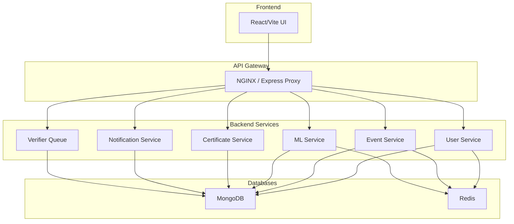

# Backend - CAMPVERSE

Welcome to the **backend** of **CAMPVERSE** — a modular, service-oriented event personalization platform. This backend exposes RESTful APIs for user management, event handling, authentication, verification, and more.

---

## ✨ System Overview
- **Microservice-inspired:** Each module (User, Event, ML, etc.) is logically separated for scalability and clarity.
- **API Gateway:** All requests flow through a gateway (NGINX/Express proxy) to backend services.
- **Database:** MongoDB for persistent data, Redis for caching, sessions, OTP, and password reset tokens.
- **CI/CD:** Automated with GitHub Actions, Docker, and ready for K8s/ECS deployment.

### **Service Architecture**

---

## 🚀 User Module: API Endpoints & Flows

### **Authentication & Registration**
| Endpoint            | Method | Request Body / Params                                                                 | Success Response Example                                                                 | Error Response Example                  |
|---------------------|--------|-------------------------------------------------------------------------------------|------------------------------------------------------------------------------------------|-----------------------------------------|
| `/register`         | POST   | `{ name, email, phone, password }`                                                   | `{ message: 'OTP sent to email.' }`                                                      | `{ error: 'All fields ... required.' }` |
| `/verify`           | POST   | `{ email, otp }`                                                                     | `{ message: 'Registration successful, logged in.', token, user }`                        | `{ error: 'Invalid OTP.' }`             |
| `/login`            | POST   | `{ email, password }`                                                                | `{ token, user }`                                                                        | `{ error: 'Incorrect password.' }`      |
| `/google-signin`    | POST   | `{ token }` (Google ID token)                                                        | `{ message: 'Google login successful', token, user }`                                    | `{ error: 'Google login failed.' }`     |

### **Profile & Preferences**
| Endpoint            | Method | Request Body / Params                                                                 | Success Response Example                                                                 | Error Response Example                  |
|---------------------|--------|-------------------------------------------------------------------------------------|------------------------------------------------------------------------------------------|-----------------------------------------|
| `/me`               | GET    | JWT in Authorization header                                                          | `user` object                                                                            | `{ error: 'User not found.' }`          |
| `/me`               | PATCH  | Any of: `{ name, phone, Gender, DOB, profilePhoto, collegeIdNumber, interests, ...}` | `{ message: 'Profile updated.', user }`                                                  | `{ error: 'No valid fields to update.' }`|
| `/updatePreferences`| POST   | `{ collegeIdNumber, interests, skills, learningGoals, badges, location }`            | `{ message: 'Preferences updated.', user }`                                              | `{ error: 'Server error ...' }`         |

### **User Dashboard & Statistics**
| Endpoint            | Method | Request Body / Params | Success Response Example | Error Response Example |
|---------------------|--------|----------------------|-------------------------|-----------------------|
| `/`                 | GET    | JWT in Authorization | `{ user, stats }`       | `{ error: ... }`      |

### **User Management & Roles**
| Endpoint                | Method | Request Body / Params | Success Response Example | Error Response Example |
|-------------------------|--------|----------------------|-------------------------|-----------------------|
| `/:id`                  | GET    | JWT, userId param    | `user` object           | `{ error: ... }`      |
| `/:id`                  | PATCH  | JWT, userId param, fields to update | `{ message: 'User updated.', user }` | `{ error: ... }` |
| `/:id`                  | DELETE | JWT, userId param    | `{ message: 'User deleted.' }` (admin) or `{ message: 'Account deletion requested. Your profile will be deleted in 30 days.' }` (self) | `{ error: ... }` |
| `/:id/grant-host`       | POST   | JWT, userId param, `{ remarks? }`   | `{ message: 'Host access granted.', user }` | `{ error: ... }` |
| `/:id/grant-verifier`   | POST   | JWT, userId param, `{ remarks? }`   | `{ message: 'Verifier access granted.', user }` | `{ error: ... }` |

### **Certificates, Achievements, Events**
| Endpoint                | Method | Request Body / Params | Success Response Example | Error Response Example |
|-------------------------|--------|----------------------|-------------------------|-----------------------|
| `/:id/certificates`     | GET    | JWT, userId param    | `[ ...certificates ]`   | `{ error: ... }`      |
| `/:id/achievements`     | GET    | JWT, userId param    | `[ ...achievements ]`   | `{ error: ... }`      |
| `/:id/events`           | GET    | JWT, userId param    | `{ hosted, attended, saved, waitlisted }` | `{ error: ... }` |

### **Password Reset**
| Endpoint            | Method | Request Body / Params | Success Response Example | Error Response Example |
|---------------------|--------|----------------------|-------------------------|-----------------------|
| `/forgot-password`  | POST   | `{ email }`          | `{ message: 'If the email exists, a reset link has been sent.' }` | `{ error: ... }` |
| `/reset-password`   | POST   | `{ token, password }`| `{ message: 'Password reset successful.' }` | `{ error: ... }` |

---

## 🛡️ Security & Access Control
- **JWT Authentication:** All protected endpoints require a valid JWT in the `Authorization` header.
- **Role-Based Access:**
  - Only `platformAdmin` can assign `host` or `verifier` roles.
  - `requireRole` and `requireSelfOrRole` middleware enforce access.
- **Account Deletion:**
  - Users can request deletion of their own profile; account is scheduled for deletion in 30 days (`deletionRequestedAt`, `deletionScheduledFor` tracked).
  - Admins can delete any user immediately.
- **Sensitive Data:** Passwords are hashed, sensitive fields never returned.
- **Rate Limiting:** Sensitive endpoints are protected from abuse.
- **Logging:** All errors and important actions are logged (Winston).
- **API Docs:** Swagger UI available at `/api-docs`.

---

## 📝 Example API Flows

### **User Registration (OTP)**
1. `POST /register` → User receives OTP via email.
2. `POST /verify` with OTP → User account created, JWT returned.

### **Google Sign-In**
1. `POST /google-signin` with Google ID token → User created/logged in, JWT returned.

### **Password Reset**
1. `POST /forgot-password` → Email sent with reset link (if user exists).
2. `POST /reset-password` with token and new password → Password updated.

### **Request Host/Verifier Access**
- User requests host access (via Host module, not shown here).
- PlatformAdmin assigns host or verifier role via `POST /:id/grant-host` or `POST /:id/grant-verifier`.

---

## 📚 Further Reading & Next Steps
- See `/api-docs` for full API documentation and try endpoints interactively.
- For event, certificate, and notification modules, see their respective documentation.
- For production, set all required environment variables and configure Docker/K8s as needed.

---
