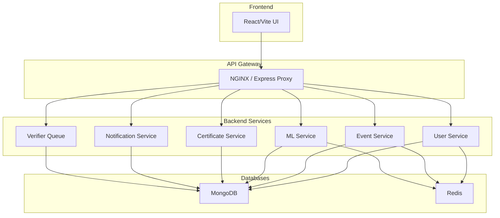

# Backend - CAMPVERSE

Welcome to the **backend** of **CAMPVERSE** — a modular, service-oriented event personalization platform. This backend exposes RESTful APIs for user management, event handling, authentication, verification, and more.

---

## ✨ System Overview
- **Microservice-inspired:** Each module (User, Event, ML, etc.) is logically separated for scalability and clarity.
- **API Gateway:** All requests flow through a gateway (NGINX/Express proxy) to backend services.
- **Database:** MongoDB for persistent data, Redis for caching, sessions, OTP, and password reset tokens.
- **CI/CD:** Automated with GitHub Actions, Docker, and ready for K8s/ECS deployment.

### **Service Architecture**

---

## 🚀 User Module: API Endpoints & Flows

### **Authentication & Registration**
- `POST /register` — Register with academic email, phone, password (OTP sent to email)
- `POST /verify` — Verify OTP and complete registration/login
- `POST /login` — Login with email and password
- `POST /google-signin` — Login/Register with Google (academic email only)

### **Profile & Preferences**
- `GET /me` — Get logged-in user profile
- `PATCH /me` — Update own profile (name, phone, gender, DOB, profile photo, college ID, interests, skills, learning goals, badges)
- `POST /updatePreferences` — Update user preferences (collegeIdNumber, interests, skills, learningGoals, badges, location)

### **User Dashboard & Statistics**
- `GET /` — User dashboard summary (events attended/hosted/saved/waitlisted, certificates, achievements, referrals, profile completion %, host/verifier status, last login, account age)

### **User Management & Roles**
- `GET /:id` — Get user by ID (self/admin)
- `PATCH /:id` — Update user by ID (self/admin)
- `DELETE /:id` — Delete user (admin only, or self with 30-day delay)
- `POST /:id/grant-host` — Grant host access (admin only)
- `POST /:id/grant-verifier` — Grant verifier access (admin only)

### **Certificates, Achievements, Events**
- `GET /:id/certificates` — Get user certificates
- `GET /:id/achievements` — Get user achievements
- `GET /:id/events` — Get user event history (hosted, attended, saved, waitlisted)

### **Password Reset**
- `POST /forgot-password` — Request a password reset (email with token sent if user exists)
- `POST /reset-password` — Reset password using the token from the email link

---

## 🛡️ Security & Access Control
- **JWT Authentication:** All protected endpoints require a valid JWT in the `Authorization` header.
- **Role-Based Access:**
  - Only `platformAdmin` can assign `host` or `verifier` roles.
  - `requireRole` and `requireSelfOrRole` middleware enforce access.
- **Account Deletion:**
  - Users can request deletion of their own profile; account is scheduled for deletion in 30 days (`deletionRequestedAt`, `deletionScheduledFor` tracked).
  - Admins can delete any user immediately.
- **Sensitive Data:** Passwords are hashed, sensitive fields never returned.
- **Rate Limiting:** Sensitive endpoints are protected from abuse.
- **Logging:** All errors and important actions are logged (Winston).
- **API Docs:** Swagger UI available at `/api-docs`.

---

## 📝 Example API Flows

### **User Registration (OTP)**
1. `POST /register` → User receives OTP via email.
2. `POST /verify` with OTP → User account created, JWT returned.

### **Google Sign-In**
1. `POST /google-signin` with Google ID token → User created/logged in, JWT returned.

### **Password Reset**
1. `POST /forgot-password` → Email sent with reset link (if user exists).
2. `POST /reset-password` with token and new password → Password updated.

### **Request Host/Verifier Access**
- User requests host access (via Host module, not shown here).
- PlatformAdmin assigns host or verifier role via `POST /:id/grant-host` or `POST /:id/grant-verifier`.

---

## 📚 Further Reading & Next Steps
- See `/api-docs` for full API documentation and try endpoints interactively.
- For event, certificate, and notification modules, see their respective documentation.
- For production, set all required environment variables and configure Docker/K8s as needed.

---
