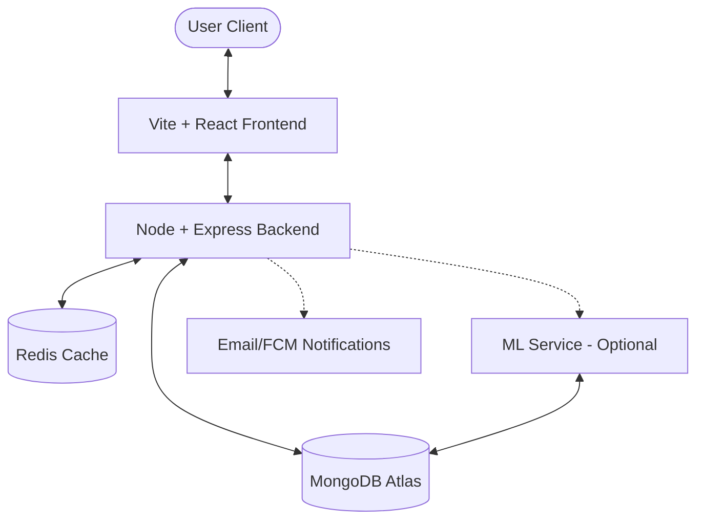

# CampVerse 🚀

CampVerse is a comprehensive full-stack ecosystem designed to revolutionize event management and discovery within academic institutions. It provides a seamless experience for students, hosts, and institutional administrators to coordinate, verify, and celebrate campus activities.

---

## 🌟 Key Features

### 🎓 For Students

- **Event Discovery**: Easily find and register for academic and social events.
- **Digital Certificates**: Automatically receive and manage verifiable event certificates with **ML-integrated generation**.
- **Secure Check-in**: High-security **QR-based entrance management** for authenticated attendance.
- **Participation Logs**: Keep track of your academic and extracurricular involvement.
- **Notifications**: Stay updated with real-time alerts for registered events.

### 🎤 For Hosts

- **Event Management**: Complete CRUD operations for event lifecycle.
- **RSVP & Waitlists**: Automated seat promotion and real-time registration monitoring.
- **Co-hosting**: Collaborate with others to manage larger events.
- **Advanced Analytics**: Deep insights into event performance, audience engagement, and platform growth trends.

### 🏛️ For Institutions

- **Verification Workflow**: Ensure the authenticity of events and certificates.
- **Institution Dashboards**: Manage institutional profiles and oversee campus activity.
- **Approval System**: Streamlined process for authorizing host status & event requests.

### 🛠️ Platform Features

- **Integrated Support**: Ticketing system for resolving user queries.
- **RBAC Security**: Granular Role-Based Access Control using JWT.
- **Search & Trends**: ML-powered discovery to highlight popular activities and personalized recommendations.

---

## 🏗️ System Architecture

CampVerse is built with a microservice-oriented mindset, ensuring scalability and separation of concerns.



### Component Breakdown

- **Frontend**: (`/Frontend`) A high-performance React application built with Vite.
- **Backend**: (`/Backend`) The core RESTful API handling business logic, Auth, and DB interactions.
- **ML Service**: (`/ML`) Python-based service for **personalized recommendations**, **analytics**, and **automated certificate layout generation**.

---

## 🛠️ Tech Stack

- **Frontend**: React, Vite, CSS Modules, JWT Auth.
- **Backend**: Node.js, Express, Mongoose (MongoDB), Redis.
- **ML/Analytics**: Python (FastAPI/Flask), pandas, scikit-learn.
- **Infrastructure**: Docker & Docker Compose, Nginx.

---

## 🚀 Getting Started

### Prerequisites

- Node.js LTS & npm
- MongoDB & Redis (running locally or via Atlas)
- Docker (optional, for containerized setup)

### Local Development (Manual)

1. **Clone the repository**

   ```bash
   git clone https://github.com/your-repo/CampVerse.git
   cd CampVerse
   ```

2. **Backend Setup**

   ```bash
   cd Backend
   npm install
   cp .env.example .env  # Configure your MongoDB/Redis/JWT secrets
   npm run dev
   ```

3. **Frontend Setup**
   ```bash
   cd ../Frontend
   npm install
   npm run dev
   ```

### Quick Start with Docker 🐳

The easiest way to get the full stack running:

```bash
docker-compose up --build
```

- **Frontend**: http://localhost:3000
- **Backend API**: http://localhost:5001
- **API Docs**: http://localhost:5001/api-docs

---

## 🔐 Security & Governance

- **Authenticated Access**: Google OAuth 2.0 restricted to academic domains (`.edu`, `.ac.in`, etc.).
- **QR-Token Exchange**: Secure, single-use tokens generated for attendance verification.
- **RBAC**: Implementation of roles like `student`, `host`, `verifier`, and `platformAdmin`.
- **Audit Trails**: Detailed logs for event verifications and certificate issuances (GPL v3.0 compliance).

---

## 📄 Documentation & Support

Detailed backend documentation can be found in `docs/backend-overview.md`. For technical support or bug reports, please use the integrated Support Ticket system or open a GitHub issue.

## 📜 License

Distributed under the GNU General Public License v3.0. See `LICENSE` for more information.
